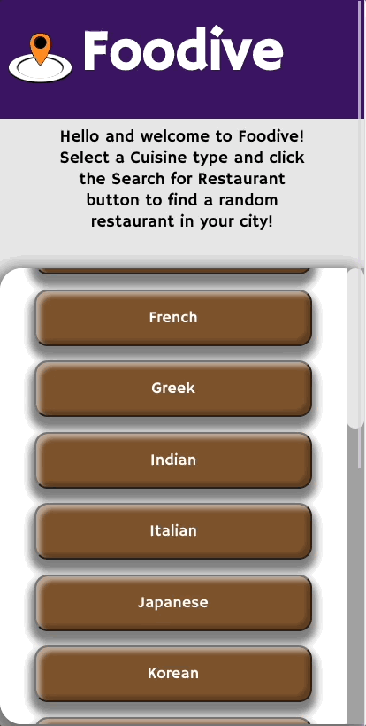
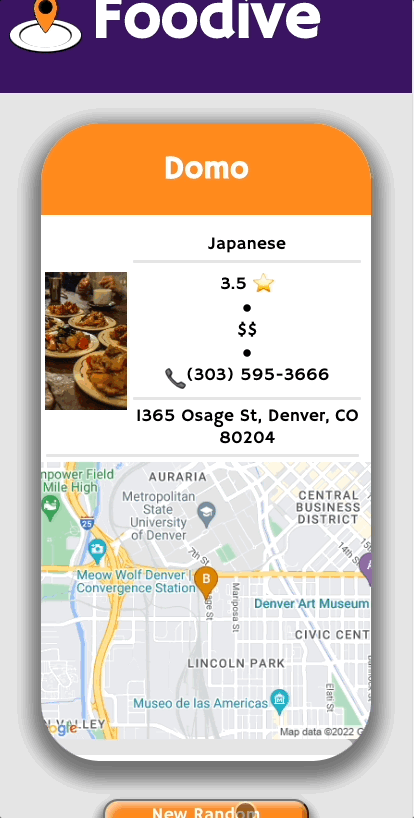

<h1 align="center">Foodive</h1>

  

  

## About the Project
Take the thinking out of picking a restaurant and use **Foodive**! Select a specific cuisine, e.g. Mexican, and you're one click away from getting a random Mexican restaurant in your city. When the restaurant is selected, business details are provided such as rating, price, and food category! This is a front-end Progressive Web Application with a partner repo: [be-foodive-python](https://github.com/foodive/be-foodive-python).

#### Built With

  
  
  
  
  
  
  
  
  

#### Goals
- Gain experience dividing applications into components and domains of responsibilities to facilitate multi-developer teams
- Explore and implement new concepts, patterns, or libraries that have not been explicitly taught while at Turing
- Build applications that execute in development, test, CI, and production environments

#### Project Specs
The rubric and specs can be found [here](https://mod4.turing.edu/projects/capstone/).

## Getting Started
1. Fork this [repository](https://github.com/foodive/fe-foodive), and clone it into your local machine.
2. Navigate into the repository and run `npm install` from your command line.
3. To view the app running inside the local host, run `npm run start-dev`.
4. To begin testing, run `npm run cypress` in a separate tab from local host tab.
5. Refer to [be-foodive-python](https://github.com/foodive/be-foodive-python) for instructions on cloning that repository down, if necessary.

## Visual Walkthrough
- User can view a list of cuisine options on the home page

- User can view a recommended restaurant based on their location and cuisine choice

## Deployed Links & Partner Repository
- [Application Link](https://foodive.herokuapp.com/) with the ability to download as an application
- [API Link](https://dnvr-boba-buddy-api.herokuapp.com/)
- [Backend Repository](https://github.com/foodive/be-foodive-python)

## Future Directions
- Give user option to input their own address
- Allow user to filter by distance radius
- Integrate ability for user to order via UberEats, Doordash, etc.
- Investigate Cypress testing with CircleCI as it relates to mocking geolocation and denying location permissions

## Contributors
#### Front-End
- Grant X Beard: [LinkedIn](https://www.linkedin.com/in/grant-x-beard/) [GitHub](https://github.com/grantxbeard)
- Lourdes Benites: [LinkedIn](https://www.linkedin.com/in/lourdesbenites/) [GitHub](https://github.com/lourdesbnts)
- Dylan Duke: [LinkedIn](https://www.linkedin.com/in/dylan-duke-005756129/) [GitHub](https://github.com/laytonmaes)
- Kristy Nguyen: [LinkedIn](https://www.linkedin.com/in/kristypnguyen/) [GitHub](https://github.com/kpn678)

#### Back-End
- Becky Nisttahuz: [LinkedIn](https://www.linkedin.com/in/becky-nisttahuz/) [GitHub](https://github.com/benistta)
- Jim Riddle: [LinkedIn](https://www.linkedin.com/in/jim-riddle-b6718037/) [GitHub](https://github.com/jimriddle1)
- Luke Swenson: [LinkedIn](https://www.linkedin.com/in/luke-swenson) [GitHub](https://github.com/LukeSwenson06)

  

